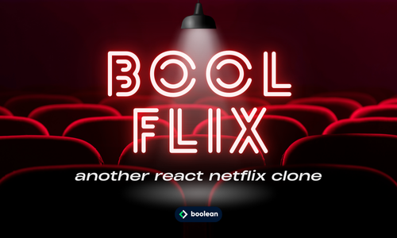

 
 

Esercizio #43 | Classe 137 | Boolean Academy

---

Studente: Fabio Ferrero

---
# English

## Target of the project:
To make a “Netflix”-style interface to browse the library of international Film\Series TV provided by the API of “TMDB”

---
# Italiano

## Obiettivo del progetto:
Realizzare un interfaccia in stile "Netflix" che permetta di consultare la libreria di Film\Serie TV internazionale fornita dalla API di "TMDB"

---

